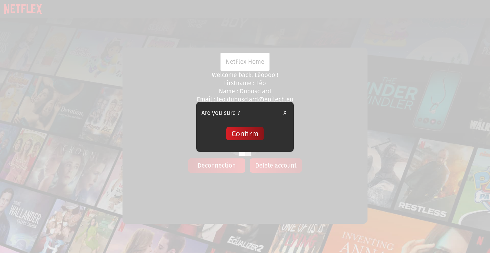
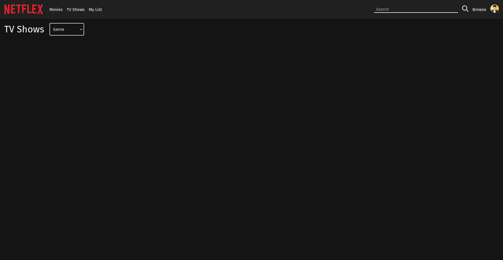

# NetFlex

## Description
Recreate a web application like Netflix to train and learn soft / web level technologies

## Technologies utilisées
- Docker (deployement) :
	- docker-compose
	- Dockerfile
- Postman (API tests)

### Frontend
- ReactJS
- HTML
- CSS
- JavaScript
- TailwindCSS

### Backend
- NodeJS
- JavaScript
- ExpressJS

### Base de données
- MariaDB
- PhpMyAdmin
- SQL

## Schema base de donnée
*netflex.sql :*
```sql
CREATE DATABASE IF NOT EXISTS netflex
    COLLATE utf8mb4_unicode_ci;

USE netflex;

CREATE TABLE IF NOT EXISTS user
(
    id BIGINT unsigned NOT NULL AUTO_INCREMENT,
    firstname VARCHAR(255) NOT NULL,
    name VARCHAR(255) NOT NULL,
    nickname VARCHAR(255) UNIQUE,
    email VARCHAR(255) UNIQUE,
    password VARCHAR(255) NOT NULL,
    create_at DATETIME NOT NULL DEFAULT current_timestamp,
    image_url TEXT NOT NULL DEFAULT "https://cdn-icons-png.flaticon.com/512/5089/5089983.png",
    PRIMARY KEY (id)
);

CREATE TABLE IF NOT EXISTS films
(
    id BIGINT unsigned NOT NULL AUTO_INCREMENT,
    show_id VARCHAR(255) UNIQUE,
    type VARCHAR(255) NOT NULL,
    title VARCHAR(255) NOT NULL,
    director VARCHAR(255),
    cast text,
    country VARCHAR(100) NOT NULL,
    date_added DATETIME NOT NULL,
    release_year VARCHAR(4) NOT NULL,
    rating VARCHAR(5) NOT NULL,
    duration VARCHAR(10) NOT NULL,
    listed_in VARCHAR(100) NOT NULL,
    description text NOT NULL,
    picture text NOT NULL,
    FULLTEXT (title, description, cast),
    PRIMARY KEY (id)
);
```

## Installation

To install NetFlex at home, please follow the instructions bellow at the root of the project (The docker-compose is not yet functional):

**Attention : If you are lazy just run the *``installation.sh``* script at the root of the project. Then refer to the *Quickstart* part**

```bash
cat netflex.sql | mysql -u root -p
```

```bash
cd backend
node json_to_db.js
npm install
```

```bash
cd frontend
npm install
```

## Quickstart
Always at the root of the project, start the API (in a first terminal) :
```bash
cd backend
npm run start
```
or (if you use Nodemon) :
```bash
cd backend
npm run dev
```
<br/>
Then, start the react application :
```bash
cd frontend
npm start
```
React will automatically redirect you to the home page of the website (localhost:3000)

## Routes Backend *(en développement)*
|Route|Method|Protected|Description|
|-----|------|---------|-----------|
|/register|POST|NO|Register a new user|
|/login|POST|NO|Connect a user|
||||
|/films|GET|YES|Get **all** movies and tv shows in the database|
|/films/type|POST|YES|Get **10** movies or tv shows depending on type given in the request body|
|/films/:id|GET|YES|Get a film by its ID|
|/films/browse|POST|YES|Get films by keywords search|
||||
|/user|GET|YES|Get user information using his Token|
|/user|DELETE|YES|Delete user using his Token|
|/user/profile_image|PUT|YES|Change user profile picture using an image url and his token|

## Features Frontend *(in development)*
<details>
	<summary>Home page (not connected)</summary>
> Home page when user is not connected 

</details>

<details>
	<summary>Home page (connected)</summary>
> Home page when user is connected

</details>

<details>
	<summary>Login page</summary>
> Login page

</details>

<details>
	<summary>Register page</summary>
> Register page

</details>

<details>
	<summary>Account settings (base)</summary>
> Basic account settings page

</details>

<details>
	<summary>Account settings (profile picture choice)</summary>
> Account settings page when profile picture choice modal is open

</details>

<details>
	<summary>Account settings (delete account)</summary>
> Account settings page when delete account modal is open

</details>

<details>
	<summary>Movies page</summary>
> All movies with filters

</details>

<details>
	<summary>TV-Shows page</summary>
> All TV Shows with filters

</details>

<details>
	<summary>Search results page</summary>
> Page displayed after search a film by its title, description or casting

</details>

<details>
	<summary>404 page</summary>
> 404 page not found

</details>

# Mainteners
- [Léo Dubosclard](https://www.github.com/ZerLock)